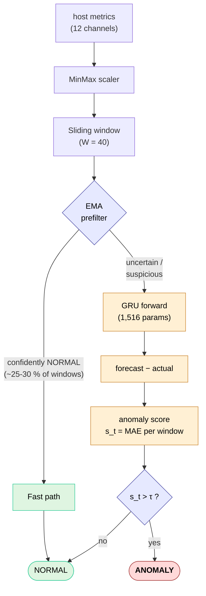

**English** · [Українська](docs/README.uk.md)

# IoT Edge AI Anomaly Detector

> Lightweight GRU-based anomaly detector for IoT host metrics — **1,516 parameters**, **0.31 ms inference**, **F1 = 0.945** on a held-out test set. Designed for edge deployment without cloud dependency.

[](https://www.python.org/downloads/)
[](LICENSE)
[](https://pytorch.org/)

The architecture was discovered by a three-phase evolutionary search with a strict no-leak evaluation protocol — dev-test and holdout-test sets stay independent throughout, so the reported number reflects real generalization rather than selection bias.

## Why

- **Tiny.** 1,516 trainable parameters; the trained model bundle is <30 KB.
- **Fast.** 0.31 ms per window on CPU; no GPU needed.
- **Accurate.** F1 = 0.945 / Precision = 0.918 / Recall = 0.973 / ROC-AUC = 0.995.
- **Honest.** Holdout is sealed off from the search loop — bias measured at 0.016 F1.
- **Self-contained.** Synthetic data generator, evolutionary search, calibration, dashboards — all in one package.
- **Production-style CLI.** 9 subcommands, `rich`-formatted output, full model bundle save/load.

## Download

Pre-built, self-contained bundles are published on the [Releases](https://github.com/1minEpowMinX/iot-edge-ai-anomaly-detector-public/releases) page — **no Python installation required**. One archive per platform, named `iot-edge-ai-anomaly-detector-{platform}.7z`:

| Platform | Asset |
|---|---|
| Windows x64 | `iot-edge-ai-anomaly-detector-win64.7z` |
| Linux x64 | `iot-edge-ai-anomaly-detector-linux64.7z` |
| macOS | `iot-edge-ai-anomaly-detector-macos.7z` |

Each archive contains the executable plus an `_internal/` folder with all dependencies bundled (PyInstaller onedir). **Keep the executable and `_internal/` together in the same folder.**

Verify the download against `SHA256SUMS.txt` attached to the release:

```bash
# Linux / macOS
sha256sum iot-edge-ai-anomaly-detector-linux64.7z
# Windows PowerShell
(Get-FileHash .\iot-edge-ai-anomaly-detector-win64.7z -Algorithm SHA256).Hash
```

## Quick start (pre-built binary)

Extract the archive, open a terminal in the extracted folder, and run:

```bash
# Windows
iot-edge-ai-anomaly-detector.exe demo
iot-edge-ai-anomaly-detector.exe demo --quick     # ~5s reduced-budget run
iot-edge-ai-anomaly-detector.exe --help

# Linux / macOS — same commands, drop the .exe and prefix with ./
./iot-edge-ai-anomaly-detector demo
```

> In the examples below the Windows executable name is used. On Linux/macOS the commands are identical — drop the `.exe` and prefix with `./`.

All artifacts (dashboards, model bundle, metadata) are written to `artifacts/`.

## Run from source (alternative)

If you prefer running from source, or are on an unlisted platform:

```bash
git clone https://github.com/1minEpowMinX/iot-edge-ai-anomaly-detector-public
cd iot-edge-ai-anomaly-detector-public
pip install -r requirements.txt
python main.py demo
```

Requirements: Python 3.10+, PyTorch 2.0+, scikit-learn, NumPy, pandas, matplotlib, psutil, rich.

> From source, replace `iot-edge-ai-anomaly-detector.exe` in any command below with `python main.py`.

## CLI

| Command   | Purpose |
|-----------|---------|
| `demo`    | Train the evolved-search winner on holdout data. Main showcase. |
| `train`   | Train with custom hyperparameters via CLI flags. |
| `infer`   | Score a CSV with a saved model bundle. |
| `live`    | Real-time host monitoring via psutil — inference-pipeline demo. |
| `collect` | Stream live host metrics to a CSV. |
| `search`  | Three-phase evolutionary search (GA → shortlist → holdout retrain). |
| `compare` | Benchmark GRU vs LSTM vs MovingAverage on identical data. |
| `ablate`  | Compare 5-metric subset (minimal spec) vs full 12-metric set. |
| `sweep`   | Sweep `window_size` and/or `hidden_size`. |

Global flags: `--version`, `-v/--verbose`, `-q/--quiet`.

## Examples

```bash
iot-edge-ai-anomaly-detector.exe demo
iot-edge-ai-anomaly-detector.exe train --epochs 100 --lr 1e-3 --hidden 16 --window 40
iot-edge-ai-anomaly-detector.exe compare              # GRU vs LSTM vs MA
iot-edge-ai-anomaly-detector.exe ablate               # 5 vs 12 metrics
iot-edge-ai-anomaly-detector.exe sweep --axis window_size
iot-edge-ai-anomaly-detector.exe search --quick       # fast evolutionary search
iot-edge-ai-anomaly-detector.exe collect --duration 60 -o my.csv
iot-edge-ai-anomaly-detector.exe infer --model artifacts/ --data my.csv
```

## How it works



The GRU is trained to forecast the next time step. Anomalies appear as large residuals between forecast and observation (MAE-based score). A lightweight EMA prefilter routes obvious-normal windows past the GRU to save compute — only `UNCERTAIN`/`ANOMALY` candidates ever reach the model. The decision threshold τ is auto-calibrated on a separate calibration set to maximize F1 (Auto-F1).

## Deploying to a real device

The shipped model is trained on **synthetic data**, so it will produce false positives on real hardware due to distribution shift. For production use:

1. Collect target-device metrics: `iot-edge-ai-anomaly-detector.exe collect --duration 3600 -o real.csv`
2. Retrain on this data: `iot-edge-ai-anomaly-detector.exe train --epochs 200`
3. Reuse the resulting bundle in `artifacts/` (`model.pt` + `scaler_*.npy` + `meta.json`).

The bundle is portable — load it with `src.artifacts.load_bundle()` on the target device.

## Results

### Holdout metrics (seed = 999, never seen during search)

| Metric             | Value          |
|--------------------|---------------:|
| **F1**             | **0.9449**     |
| Precision          | 0.9184         |
| Recall             | 0.9730         |
| ROC-AUC            | 0.995          |
| Parameters         | 1,516          |
| Inference latency  | 0.31 ms/window |
| Model bundle size  | ~28 KB         |

**Winner genome:** `window_size=40, hidden_size=8, num_layers=3, dropout=0.4, lr=3e-3`.

### Model comparison (`compare`)

| Model          | Precision | Recall  | F1        | Params | Inference |
|----------------|----------:|--------:|----------:|-------:|----------:|
| **GRU**        | 0.918     | 0.973   | **0.945** | 1,516  | 0.31 ms   |
| LSTM           | 0.741     | 1.000   | 0.851     | 6,348  | 0.29 ms   |
| Moving Average | 0.442     | 0.984   | 0.610     | 0      | 0.004 ms  |

### Selection-bias check

- Dev-test F1 (during search): **0.961**
- Holdout F1 (sealed off): **0.945**
- **Gap: 0.016 F1** — within expected range for a properly-protected no-leak protocol.

## Design rationale

| Decision | Rationale |
|---|---|
| **GRU** over LSTM | Fewer parameters at equal F1; verified empirically by `compare`. |
| **Linear readout** | Without activation, a 2-layer MLP head collapses to a single Linear; with activation, no F1 improvement observed. |
| **Huber loss** (training) | Robust to occasional outliers in nominally-normal training data. |
| **MAE** (anomaly score) | Linear response amplifies the contrast between normal noise and anomalous spikes — opposite of what Huber does. |
| **AdamW + ReduceLROnPlateau** | Decoupled weight decay + adaptive learning rate. |
| **Early stopping with patience-reset on lr-drop** | Avoids killing models that can still improve at a lower lr. |
| **Asymmetric EMA prefilter** | Fast-paths only confidently-normal windows; suspicious ones always reach the GRU. Preserves recall while saving ~25–30 % of forward passes. |
| **Auto-F1 threshold calibration** | Threshold chosen on a labelled calibration set, not arbitrarily at the 95th percentile. |
| **No-leak protocol** | Holdout test (seed=999) is never used during search. Dev-test (seed=123) is for fitness only. |
| **12 metrics** instead of 5 | Disk/swap/process channels are essential for I/O storms, memory leaks, fork bombs; ablation confirms +0.20 F1. |
| **Evolutionary search** | Finds smaller, better architectures than hand-tuning (1.5K vs 12K params, +0.04 F1). |

## Project layout

```
main.py                    CLI entrypoint (python main.py)
src/                       Production package
├── __init__.py            Public API + __version__
├── cli.py                 argparse + 9 subcommands
├── _ui.py                 rich-based UI with plain-text fallback
├── config.py              AppConfig + all sub-configs
├── data.py                Synthetic generator + DataModule + scaler + windows
├── model.py               GRUNet / LSTMNet
├── predictors.py          BasePredictor + Torch/MovingAverage predictors
├── losses.py              Huber / MSE / MAE factory
├── prefilter.py           EMA / MA cascade prefilter
├── detector.py            AnomalyDetector + prf1 + roc_pr_curves (scikit-learn)
├── pipeline.py            Pipeline orchestration + RunResult
├── reporter.py            Reporter (console + dashboards)
├── visualize.py           matplotlib plotters
├── artifacts.py           Model bundle save/load
└── experiments/           Lab + production runners
    ├── evolution.py       Genome / SearchSpace / GA / shortlist / retrain
    ├── search.py          Three-phase orchestration
    ├── demo.py            Showcase runner
    ├── train.py           Configurable training runner
    ├── infer.py           CSV inference
    ├── live.py            Real-time psutil monitor
    ├── collect.py         psutil sampler
    ├── comparison.py      Model comparison
    ├── ablation.py        Feature-set ablation
    └── sweep.py           Hyperparameter sweeps
```

## Background

Built originally as an engineering thesis on edge AI / time-series anomaly detection. The methodological focus is on:

- Treating anomaly detection as **next-step forecasting with thresholded residuals** rather than reconstruction or classification.
- An end-to-end **no-leak research protocol** that separates hyperparameter selection from final evaluation.
- Demonstrating that **evolutionary search can find compact, edge-deployable architectures** that outperform hand-tuned baselines.

If any of these are useful in your own work — feel free to fork, cite, or open an issue.

## License

[MIT](LICENSE) © 2026 1minEpowMinX.
