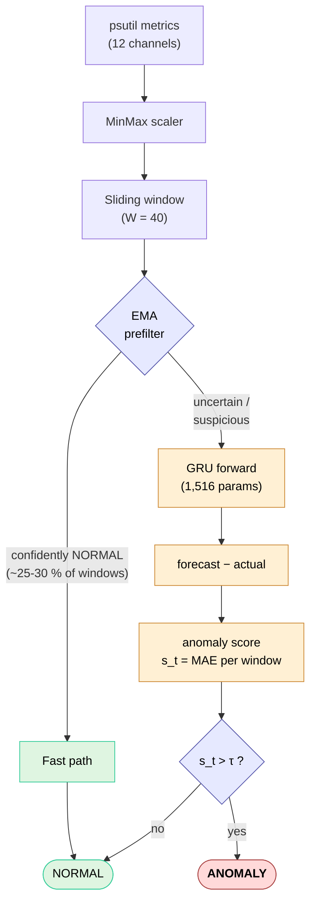

[English](../README.md) · **Українська**

# IoT Edge AI Anomaly Detector

> Легковагова система виявлення аномалій в IoT-метриках на основі GRU — **1 516 параметрів**, **0.31 мс інференції**, **F1 = 0.945** на незалежному holdout-тесті. Розрахована на edge-розгортання без хмарної залежності.

[](https://www.python.org/downloads/)
[](../LICENSE)
[](https://pytorch.org/)

Архітектура знайдена трифазним еволюційним пошуком зі строгим no-leak протоколом — dev-test та holdout-test набори лишаються незалежними протягом усього процесу, тому отримана оцінка відображає реальну генералізацію, а не selection bias.

## Чому

- **Маленька.** 1 516 навчальних параметрів; bundle моделі важить <30 КБ.
- **Швидка.** 0.31 мс на одне вікно на CPU; GPU не потрібен.
- **Точна.** F1 = 0.945 / Precision = 0.918 / Recall = 0.973 / ROC-AUC = 0.995.
- **Чесна.** Holdout повністю ізольований від циклу пошуку — виміряний bias 0.016 F1.
- **Самодостатня.** Генератор синтетичних даних, еволюційний пошук, калібровка, дашборди — все в одному пакеті.
- **Production-style CLI.** 9 субкоманд, `rich`-форматування виводу, повне збереження/завантаження bundle.

## Встановлення

```bash
git clone https://github.com/1minEpowMinX/iot-edge-ai-anomaly-detector-public
cd iot-edge-ai-anomaly-detector-public
pip install -r requirements.txt
```

Вимоги: Python 3.10+, PyTorch 2.0+, scikit-learn, NumPy, pandas, matplotlib, psutil, rich.

## Швидкий старт

```bash
python -m src demo            # 30-секундна демонстрація — тренує переможця еволюції, F1 = 0.945
python -m src demo --quick    # ~5 с прискорений варіант
python -m src --help          # перелік усіх команд
```

Усі артефакти (дашборди, bundle моделі, метаінформація) пишуться в `artifacts/`.

## CLI

| Команда   | Призначення |
|-----------|-------------|
| `demo`    | Тренує переможця еволюційного пошуку на holdout-даних. Головна демонстрація. |
| `train`   | Тренування з налаштовуваними гіперпараметрами через CLI. |
| `infer`   | Інференс на CSV-файлі зі збереженою моделлю. |
| `live`    | Real-time моніторинг хоста через psutil — демонстрація inference-pipeline. |
| `collect` | Збирає реальні метрики хоста у CSV. |
| `search`  | Трифазний еволюційний пошук (GA → shortlist → holdout retrain). |
| `compare` | Порівняння GRU vs LSTM vs MovingAverage на однакових даних. |
| `ablate`  | Аблація: 5-метричний підмножина (мінімальна за ТЗ) vs повний 12-метричний набір. |
| `sweep`   | Розгортка `window_size` та/або `hidden_size`. |

Глобальні прапорці: `--version`, `-v/--verbose`, `-q/--quiet`.

## Приклади

```bash
python -m src demo
python -m src train --epochs 100 --lr 1e-3 --hidden 16 --window 40
python -m src compare                            # GRU vs LSTM vs MA
python -m src ablate                             # 5 vs 12 ознак
python -m src sweep --axis window_size           # варіація довжини вікна
python -m src search --quick                     # швидкий еволюційний пошук
python -m src collect --duration 60 -o my.csv    # збір реальних метрик
python -m src infer --model artifacts/ --data my.csv
```

## Як це працює



GRU тренується прогнозувати наступний крок. Аномалії проявляються як значні відхилення прогнозу від реального значення (MAE-based score). Легковаговий EMA-передфільтр відсіює явно нормальні вікна, щоб зекономити обчислення — до GRU доходять тільки `UNCERTAIN`/`ANOMALY` кандидати. Поріг прийняття рішення τ автоматично калібрується на окремому калібрувальному наборі для максимізації F1 (метод Auto-F1).

## Розгортання на реальному IoT-пристрої

Модель у комплекті навчена на синтетичних даних, тому на реальному обладнанні **будуть** false positives через distribution shift. Для production-використання:

1. Зібрати метрики цільового пристрою: `python -m src collect --duration 3600 -o real.csv`
2. Перенавчити на цих даних: `python -m src train --epochs 200`
3. Розгорнути отриманий bundle `artifacts/model.pt` + `scaler_*.npy` + `meta.json`.

Bundle портативний — завантажується через `src.artifacts.load_bundle()` на цільовому пристрої.

## Результати

### Holdout-метрики (seed = 999, ніколи не бачені під час пошуку)

| Метрика             | Значення        |
|---------------------|----------------:|
| **F1**              | **0.9449**      |
| Precision           | 0.9184          |
| Recall              | 0.9730          |
| ROC-AUC             | 0.995           |
| Параметри           | 1 516           |
| Час інференції      | 0.31 мс / вікно |
| Розмір bundle       | ~28 КБ          |

**Геном переможця:** `window_size=40, hidden_size=8, num_layers=3, dropout=0.4, lr=3e-3`.

### Порівняння моделей (`python -m src compare`)

| Модель         | Precision | Recall  | F1        | Параметри | Інференс  |
|----------------|----------:|--------:|----------:|----------:|----------:|
| **GRU**        | 0.918     | 0.973   | **0.945** | 1 516     | 0.31 мс   |
| LSTM           | 0.741     | 1.000   | 0.851     | 6 348     | 0.29 мс   |
| Moving Average | 0.442     | 0.984   | 0.610     | 0         | 0.004 мс  |

### Перевірка на selection bias

- F1 на dev-test (під час пошуку): **0.961**
- F1 на holdout (ізольований): **0.945**
- **Розрив: 0.016 F1** — у межах очікуваного для правильно захищеного no-leak протоколу.

## Архітектурні рішення

| Рішення | Обґрунтування |
|---|---|
| **GRU** замість LSTM | Менше параметрів при тому ж F1; емпірично підтверджено через `compare`. |
| **Linear readout** | Без активації MLP-head колапсує в один Linear; з активацією покращення F1 не зафіксовано. |
| **Huber loss** (навчання) | Стійкий до випадкових викидів у нібито нормальних тренувальних даних. |
| **MAE** (anomaly score) | Лінійний відгук підсилює контраст між нормальним шумом та аномальними сплесками — на відміну від Huber, який його гасить. |
| **AdamW + ReduceLROnPlateau** | Decoupled weight decay + адаптивний learning rate. |
| **Early stopping із patience-reset при lr-drop** | Не вбиває моделі, які ще можуть навчатися на нижчому lr. |
| **Асиметричний EMA-передфільтр** | По швидкому шляху йдуть тільки явно нормальні вікна; підозрілі завжди доходять до GRU. Зберігає recall, економить ~35 % forward-проходів. |
| **Auto-F1 калібровка порогу** | Поріг підбирається на окремому labelled-наборі, а не ставиться довільно на 95-й перцентиль. |
| **No-leak протокол** | Holdout test (seed=999) ніколи не використовується під час пошуку. Dev-test (seed=123) — тільки для fitness. |
| **12 метрик** замість 5 | Канали диску / swap / процесів критичні для I/O штормів, витоків пам'яті, fork-bomb; аблація підтверджує приріст +0.20 F1. |
| **Еволюційний пошук** | Знаходить менші й кращі архітектури, ніж ручний тюнінг (1.5K параметрів vs 12K, +0.04 F1). |

## Структура проєкту

```
src/                       Production-пакет
├── __init__.py            Публічний API + __version__
├── __main__.py            CLI entrypoint (python -m src)
├── cli.py                 argparse + 9 субкоманд
├── _ui.py                 rich UI з plain-text fallback
├── config.py              AppConfig + усі sub-config'и
├── data.py                Генератор синтетики + DataModule + scaler + вікна
├── model.py               GRUNet / LSTMNet
├── predictors.py          BasePredictor + Torch/MovingAverage predictors
├── losses.py              Фабрика Huber / MSE / MAE
├── prefilter.py           EMA / MA каскадний передфільтр
├── detector.py            AnomalyDetector + prf1 + roc_pr_curves (scikit-learn)
├── pipeline.py            Pipeline + RunResult
├── reporter.py            Reporter (консоль + дашборди)
├── visualize.py           matplotlib плотери
├── artifacts.py           Збереження / завантаження bundle моделі
└── experiments/           Лабораторні + production раннери
    ├── evolution.py       Genome / SearchSpace / GA / shortlist / retrain
    ├── search.py          Трифазна оркестрація
    ├── demo.py            Showcase-раннер
    ├── train.py           Configurable training runner
    ├── infer.py           CSV-інференс
    ├── live.py            Real-time psutil monitor
    ├── collect.py         psutil-семплер
    ├── comparison.py      Порівняння моделей
    ├── ablation.py        Аблація набору ознак
    └── sweep.py           Гіперпараметричні розгортки
```

## Контекст

Проєкт спершу створювався як інженерна дипломна робота з тематики edge AI / виявлення аномалій у часових рядах. Методологічний фокус на:

- Трактуванні задачі виявлення аномалій як **прогнозу наступного кроку з порогом на залишку** (а не реконструкції чи класифікації).
- Наскрізному **no-leak дослідницькому протоколі**, що відокремлює підбір гіперпараметрів від фінальної оцінки.
- Демонстрації того, що **еволюційний пошук знаходить компактні, придатні для edge архітектури**, які перевершують ручний тюнінг.

Якщо щось із цього корисне у вашій роботі — форкайте, цитуйте або відкривайте issue.

## Ліцензія

[MIT](../LICENSE) © 2026 1minEpowMinX.
